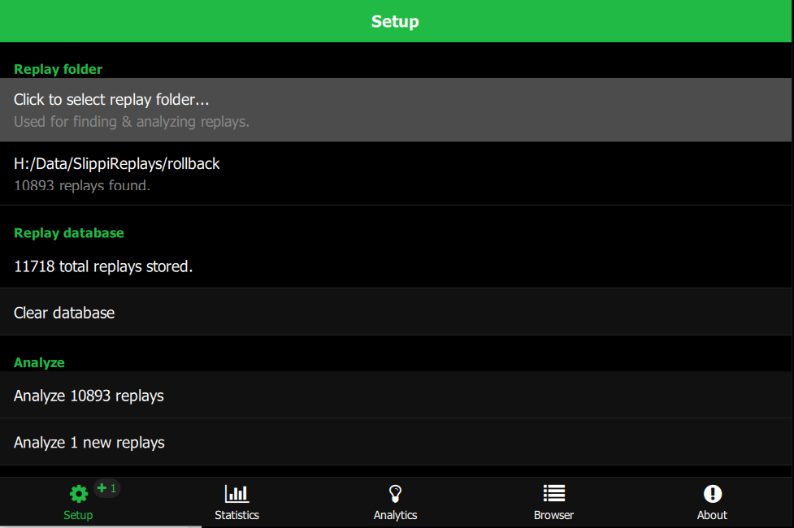
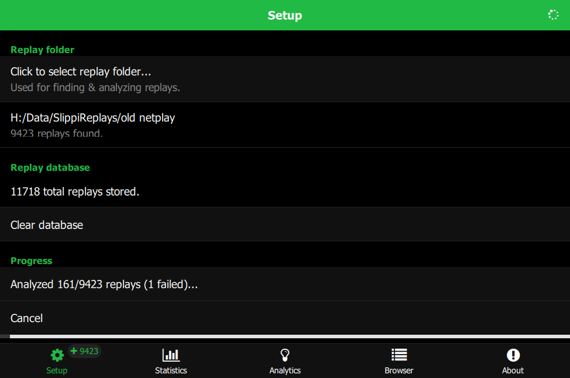
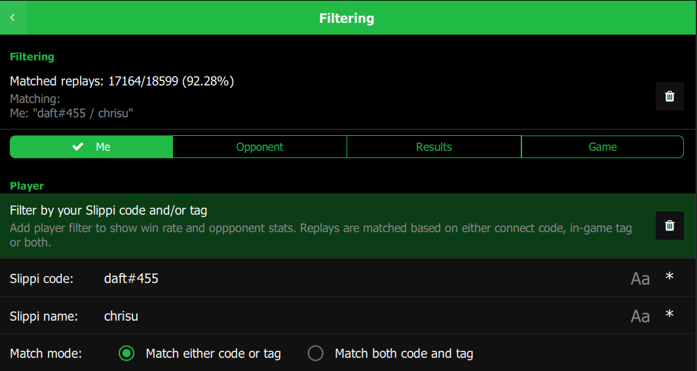
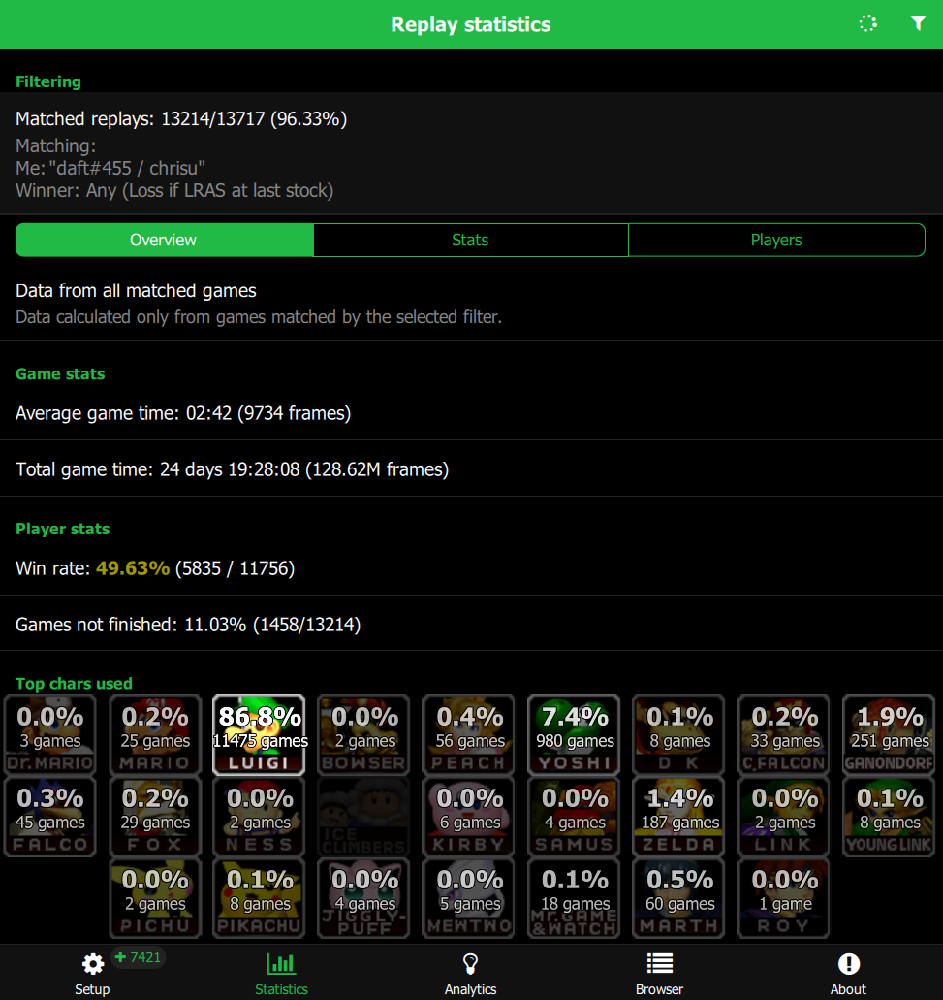
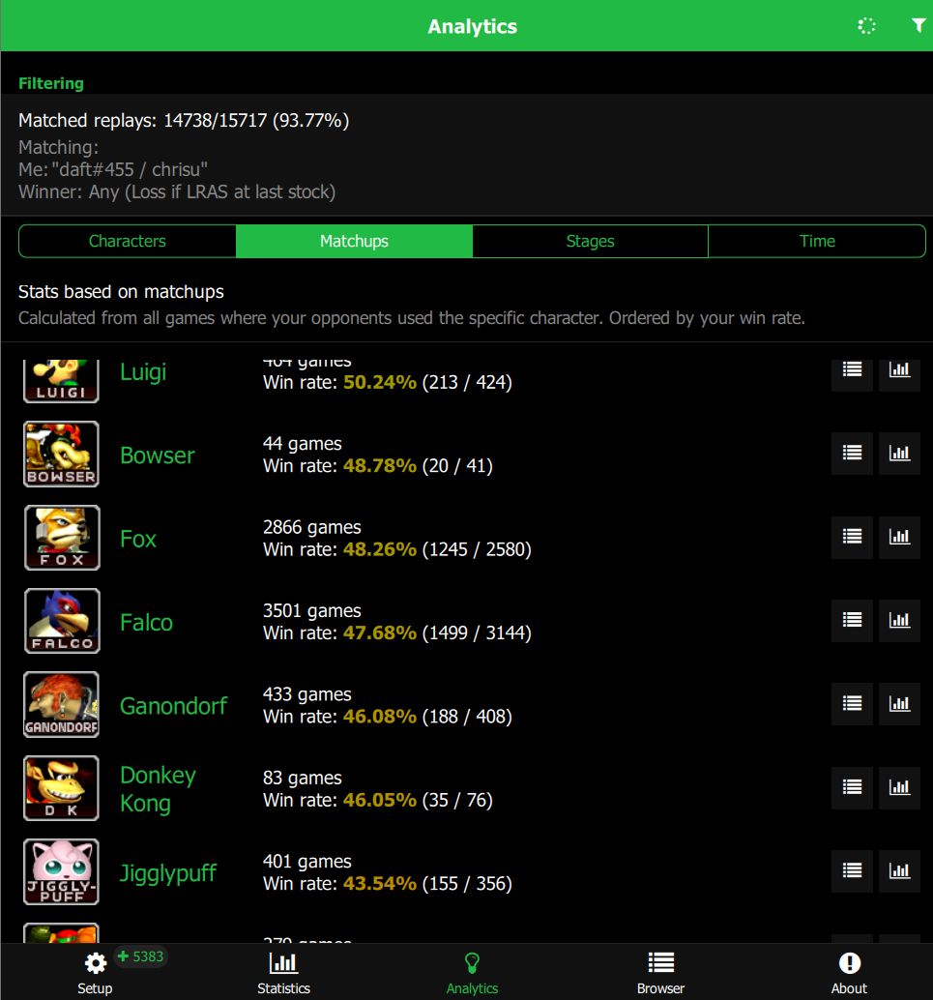
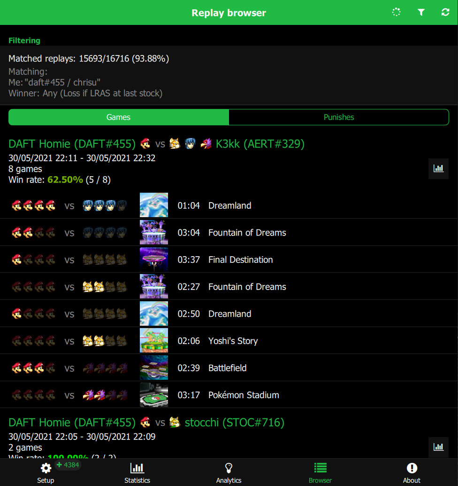
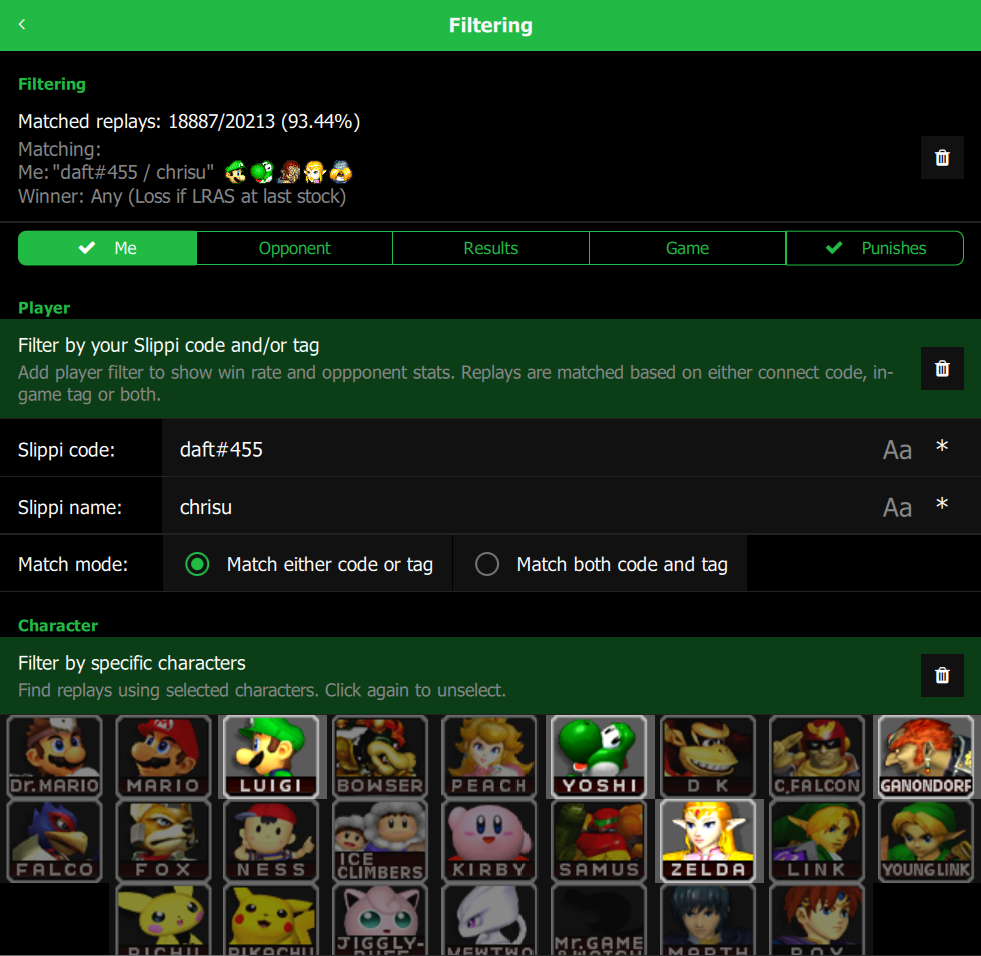
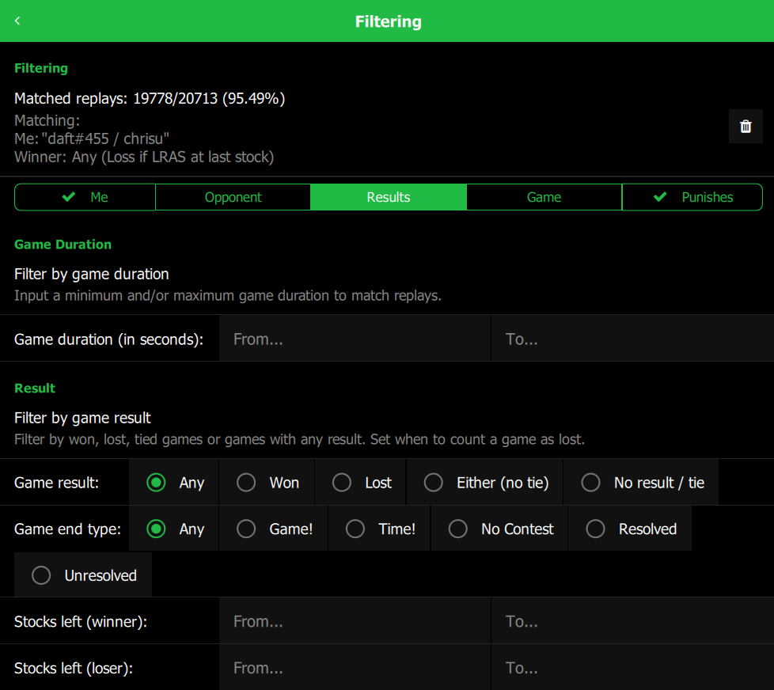
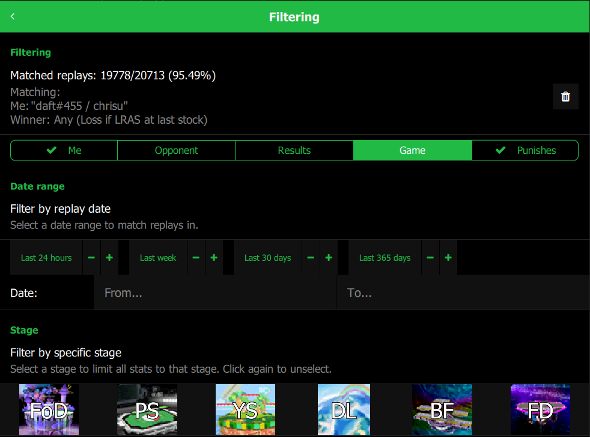

# Slippipedia - Your flexible replay manager

This program can analyze a large number of Slippi replays and display detailed, filterable statistics and info.


# Download

Download the [latest release](https://github.com/cbartsch/Slippipedia/releases/latest) for your OS.

# Table of Contents

* [Credits](#credits)
* [Contact](#contact)
* [How to Use](#how-to-use)
  * [Select replay folder](#select-replay-folder)
  * [Analyze replays](#analyze-replays)
  * [Set player filter](#set-player-filter)
  * [Explore stats](#explore-stats)
    * [Statistics](#statistics)
    * [Analytics](#analytics)
    * [Browser](#browser)
  * [Filtering](#filtering)
  	* [Player and opponent filter](#player-and-opponent-filter)
  	* [Game result filter](#game-result-filter)
  	* [Game filter](#game-filter)
* [Building & Deployment](#building--deployment)
  * [Deployment](#deployment)
    * [MacOS](#macos)
    * [Windows](#windows)

# Credits

* Slippi ([slippi.gg](https://slippi.gg))
* Slippc ([GitHub](https://github.com/pcrain/slippc)) - Slippi replay parser in C++
* Built with Felgo SDK ([felgo.com](https://felgo.com))
* Game sprites ripped on [spriters-resource.com](https://www.spriters-resource.com/gamecube/ssbm/) by [Mr C.](https://www.spriters-resource.com/submitter/Mr.+C/) and [Colton](https://www.spriters-resource.com/submitter/Colton/)

# Contact

Made by me (Chrisu). For feedback, bug reports, feature requests etc. use the issue tracker on this page or contact me via social media:

* Twitter - [ChrisuSSBMtG](https://twitter.com/ChrisuSSBMtG)

# How to Use

Download the latest release for your operating system. Start the included `.app` or the `.exe` file.

## Select replay folder

Select your Slippi replay directory. Per default, this should be in `(documents)/Slippi`. In this case, the folder should be pre-selected automatically.



## Analyze replays

This step reads each replay and stores the relevant information in a database for fast lookup. 
Depending on your setup and the number of replays, this can take a few minutes.

Replays only need to be analyzed once. The database persists after app restarts.
When you have new replays or change the folder, you can choose to only analyze new replays.



## Set player filter

For more detailed output, like win rate and opponent stats, set your Slippi name and/or tag in the filter configuration.



## Explore stats

Use the tabs to explore data about your replays. 

### Statistics

Statistics shows global stats. 

First tab shows number of games, win rate, character usage (me/opponent), stage usage. 

Second tab shows detailed stats. 

Third tab shows player tags and codes. Click a code to show all games with or versus that specific player.



### Analytics

Analytics groups stats by character, matchup, stage and time frame. 

Click the statistics icon to show statistics for a certain group. Click the list icon to show those games in the browser.



### Browser

Browser lists the replays one by one. 

Click the play icon to can re-watch them (needs [Slippi Desktop app](https://github.com/project-slippi/slippi-desktop-app)). Click the folder icon to find a specific replay file on your file system.

Click the statistics icon for a session to show statistics pre-filtered for exactly those games.



## Filtering

Restrict your replays by detailed criteria. All other stats, analytics and browser consider the filter settings.

Navigate back to show filtered data.

### Player and opponent filter

First tab lets configures the player filter. Set your Slippi name and/or tag to enable win rate, opponent data etc. You can also filter by one or more specific characters.



Second tab lets you filter for specific opponents and characters.

### Game result filter

Third tab lets you filter by game results. Set a min/max game duration, game outcom and remaining stocks. You can use this e.g. to filter short games that probably did not finish.



### Game filter

Fourth tab lets you filter by game data. Set a time frame and one or more specific stages.



# Building & Deployment

The project can be built with the [Felgo SDK](https://felgo.com).
Open the file `Slippipedia.pro` in Qt Creator and build for one of the supported platforms:

* Mac OS (Clang)
* Windows (MinGW)

To create a release build, change build stage in `qml/config.json` to `"stage":"publish"`.

## Deployment

For deployment, the referenced libraries need to be added to the binary. 
This can be done with the included deployment tools from Qt.

### MacOS

Create a release build, then use `macdeployqt`.
* Add the option `-qmldir=<qml_dir>` to specify the QML folder to scan for plugin imports.
* Add the option `-dmg` to output a disk image.
* Add the option `-codesign=<certificate_id>`to sign the disk image.

```
/Applications/Felgo/Felgo/clang_64/bin/macdeployqt Slippipedia.app -qmldir="$(pwd)/../../qml" -dmg -codesign=VB6Z5JQJTD
```

### Windows

Create a release build, then copy the .exe file Somewhere.
Use `windeployqt` from a Qt command line (use `qtenv2.bat` to set up the environment).

Add the `-qmldir` parameter so it finds all dependencies from QML imports.

```
> windeployqt -qmldir ../../qml .
```

This adds all the libraries to the folder next to the `.exe` file.


