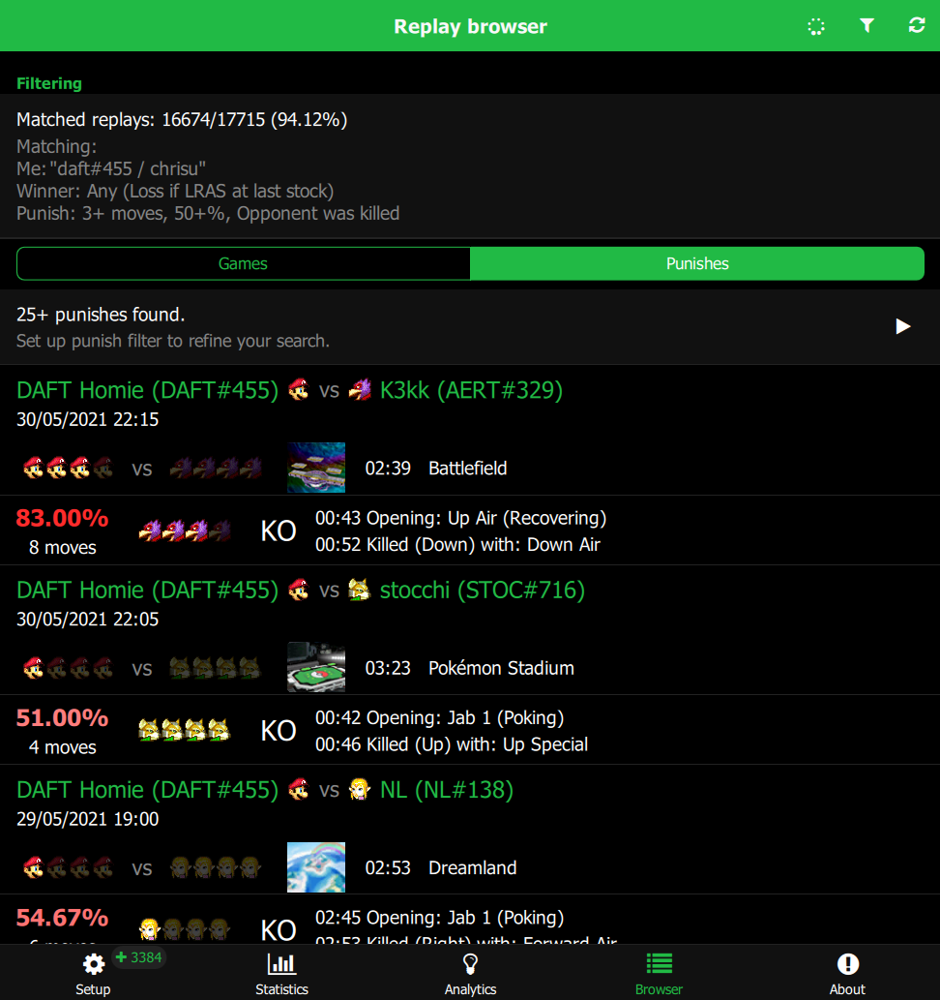
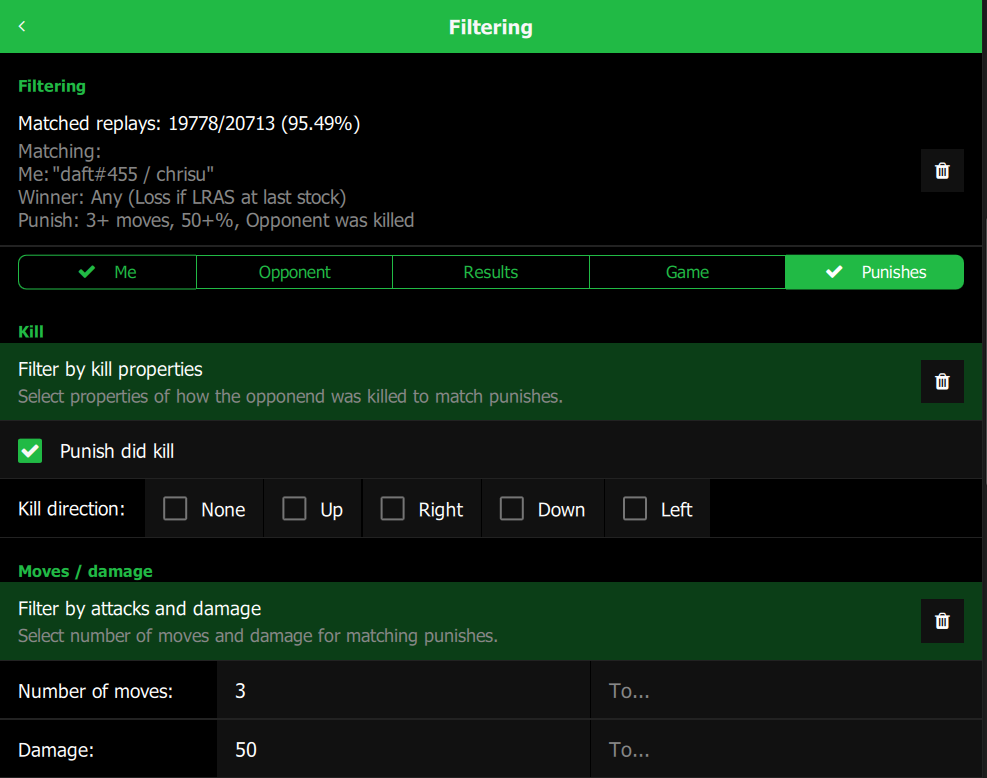

# Slippipedia - Your flexible replay manager

This program can analyze a large number of Slippi replays and display detailed, filterable statistics and info.


# Download

Download the [latest release](https://github.com/cbartsch/Slippipedia/releases/latest) for your OS.

# Contact

Made by me (Chrisu). For feedback, bug reports, feature requests etc. use the issue tracker on this page or contact me via social media:

* Twitter - https://twitter.com/ChrisuSSBMtG
* Support me on Patreon - https://www.patreon.com/chrisu
* DAFT Home Community Discord - https://discord.gg/jKf9XQE

# Credits
https://twitter.com/ChrisuSSBMtG/status/1586861084161581056
* Slippi ([slippi.gg](https://slippi.gg))
* Slippc ([GitHub](https://github.com/pcrain/slippc)) - Slippi replay parser in C++
* Built with Felgo SDK ([felgo.com](https://felgo.com))
* Game sprites ripped on [spriters-resource.com](https://www.spriters-resource.com/gamecube/ssbm/) by [Mr C.](https://www.spriters-resource.com/submitter/Mr.+C/) and [Colton](https://www.spriters-resource.com/submitter/Colton/)


# Table of Contents

* [How to Use](#how-to-use)
  * [Select replay folder](#select-replay-folder)
  * [Analyze replays](#analyze-replays)
  * [Slippi settings](#slippi-settings)
  * [Video output](#video-output)
  * [Set player filter](#set-player-filter)
  * [Explore stats](#explore-stats)
    * [Statistics](#statistics)
    * [Analytics](#analytics)
    * [Browser](#browser)
    * [Punishes](#punishes)
  * [Filtering](#filtering)
  	* [Player and opponent filter](#player-and-opponent-filter)
    * [Game result filter](#game-result-filter)
    * [Game loss type setting](#game-loss-type-setting)
    * [Game filter](#game-filter)
    * [Punish filter](#punish-filter)
* [Building & Deployment](#building--deployment)
  * [Deployment](#deployment)
    * [MacOS](#macos)
    * [Windows](#windows)


# How to Use

Download the latest release for your operating system. Start the included `.app` or the `.exe` file.

## Select replay folder

Select your Slippi replay directory. Per default, this should be in `(documents)/Slippi`. In this case, the folder should be pre-selected automatically.


## Analyze replays

This step reads each replay and stores the relevant information in a database for fast lookup. 
Depending on your setup and the number of replays, this can take a few minutes.

Replays only need to be analyzed once. The database persists after app restarts.
When you have new replays or change the folder, you can choose to only analyze new replays.


## Slippi settings

To start replays and punishes directly from Slippipedia, set your Slippi Desktop App folder.
You can download the app from [slippi.gg](https://slippi.gg/downloads).
If you installed it in the default path, Slippipedia can probably auto-detect it.

Also set the path to your Melee ISO file to auto-start replays/punishes.
You can also leave this empty and start Melee from the replay Dolphin manually.


## Video output

Slippipedia can automatically convert playback to MP4 video files.
It can convert any replay that is started through Slippipedia.

### How to save video files

There is some setup required for this:

1. Enable frame dumps in the playback Dolphin.
   
   You can open the playback dolphin by clicking the Slippi icon on the setup page.
   Then open the `"Movie"` menu and enable `"Dump frames"` and `"Dump audio"`.


2. Install `ffmpeg`. 
   
   These are the command line tools required for video conversion.
   On Windows, a build is shipped with Slippipedia directly.
   On macOS/Unix, you can install it with homebrew (`brew install ffmpeg`).

3. Enable saving frame dumps
   
   On the setup page, check the `"Save Dolphin frame dumps"` option.
   It is recommended to also check the `"Auto-delete original frame dumps"` option.
   Otherwise, Dolphin will ask to overwrite the frame and audio dumps every time.

   Below you can also change the folder for video export.


4. Start playback through Slippipedia

   Play back any replay, stock or punish from the browser page.

5. Save the frame dump

   After closing Dolphin (make sure all Dolphin windows are closed),
   Slippipedia will ask to save the frame dumps.


6. Video is converted

  Slippipedia will now combine Dolphin's frame and audio dumps into one MP4 file.
  Check the bottom of the setup page for progress and to find the output file.


### Video quality & performance

The video quality depends on the Dolphin frame dump settings.
Per default, the video resolution is the same as the playback resolution.

You can also save it at the internal resolution set in the graphics settings.
To enable this, open playback Dolphin and enable `Graphics -> Advanced -> Full Resolution Frame Dumps`.


The original bitrate is configured in the file `User/Config/GFX.ini` as `BitrateKbps`.

If you just want to export a video, you can set Dolphin to run at an aribtrary frame rate.
To do so, go to `Config -> General` and set `Speed Limit` to `"Unlimited"`.
Thus the game can run as fast as your setup allows.
The resulting video file will still run at normal 60 fps.


Slippipedia then converts it with the encoder settings from the bottom of setup page.


## Set player filter

For more detailed output, like win rate and opponent stats, set your Slippi name and/or tag in the filter configuration.


## Explore stats

Use the tabs to explore data about your replays. 

### Statistics

Statistics shows global stats. 

First tab shows number of games, win rate, character usage (me/opponent), stage usage. 

Second tab shows detailed stats. 

Third tab shows player tags and codes. Click a code to show all games with or versus that specific player.


### Analytics

Analytics groups stats by character, matchup, stage and time frame. 

Click the statistics icon to show statistics for a certain group. Click the list icon to show those games in the browser.


### Browser

Browser lists the replays one by one. 

Click the play icon to can re-watch them (needs [Slippi Desktop app](https://github.com/project-slippi/slippi-desktop-app)). Click the folder icon to find a specific replay file on your file system.

Click the statistics icon for a session to show statistics pre-filtered for exactly those games.


### Punishes

The browser can also show your punishes for every game.
Switch to the punishes tab on top.

You can replay all currently displayed punishes with the play button at the very top.
You can also replay only a specific session's or specic game's punishes with the corresponding play button.
To replay, set the Slippi Desktop App folder and optionally the Melee ISO folder in the setup tab.

Per default it shows all punishes, regardless of number of moves or damage.
This includes single hits.

To refine the search, you can filter by various properties.
See [Filtering](#filtering) for more info.




## Filtering

Restrict your replays by detailed criteria. All other stats, analytics and browser consider the filter settings.

Navigate back to show filtered data.

### Player and opponent filter

First tab lets configures the player filter. Set your Slippi name and/or tag to enable win rate, opponent data etc. You can also filter by one or more specific characters.


Second tab lets you filter for specific opponents and characters.

### Game result filter

Third tab lets you filter by game results.

Set a min/max game duration, game outcome and remaining stocks for each player.

You can also filter by the ending type to find timeouts and otherwise tied games.


### Game loss type setting

This tab also lets you change a global game loss type setting.
This determines how Slippipedia counts a game as lost vs. as a tie.
It affects the filters and the various win rate displays.

There are five options to choose from.

A game can count as lost only when the last stock is gone.
It can also count if a player quits via LRAS at any point or during their last stock.

The last options count a game as lost for any player with fewer stocks or higher percent,
either at any point or only during the loser's last stock.


### Game filter

Fourth tab lets you filter by game data. Set a time frame and one or more specific stages.


### Punish filter

Fifth tab lets you filter the punishes.
Set kill properties, a range for number of moves, dealt damage and player percent.
You can also set more specific move options.

**Note:** This tab is only available when filtering from the punishes tab in the replay browser.




# Building & Deployment

The project can be built with the [Felgo SDK](https://felgo.com).
Open the file `Slippipedia.pro` in Qt Creator and build for one of the supported platforms:

* Mac OS (Clang)
* Windows (MinGW)

To create a release build, change build stage in `qml/config.json` to `"stage":"publish"`.

## Deployment

For deployment, the referenced libraries need to be added to the binary. 
This can be done with the included deployment tools from Qt.

### MacOS

Create a release build, then use `macdeployqt`.
* Add the option `-qmldir=<qml_dir>` to specify the QML folder to scan for plugin imports.
* Add the option `-dmg` to output a disk image.
* Add the option `-codesign=<certificate_id>`to sign the disk image.

```
/Applications/Felgo/Felgo/clang_64/bin/macdeployqt Slippipedia.app -qmldir="$(pwd)/../../qml" -dmg -codesign=VB6Z5JQJTD
```

### Windows

Create a release build, then copy the .exe file Somewhere.
Use `windeployqt` from a Qt command line (use `qtenv2.bat` to set up the environment).

Add the `-qmldir` parameter so it finds all dependencies from QML imports.

```
> windeployqt -qmldir ../../qml .
```

This adds all the libraries to the folder next to the `.exe` file.
